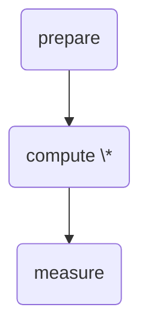

# Designing a Software Stack for Quantum Programs with Error Correction

Quantum processors differ fundamentally from classical computers. They leverage particles governed by quantum mechanics to perform computations using principles like superposition, entanglement, and interference. These properties allow quantum processors to perform certain tasks far more efficiently than classical computers. However, this efficiency comes at a cost: quantum computations are prone to extremely high error rates, which make long-running computations infeasible.

Error correction techniques, analogous to those used in long-distance communication, can mitigate this problem. The objective is to enable long-running quantum calculations by transparently integrating an error correction layer that reduces the error rate sufficiently to avoid computational failures. It is not that errors are completely removed, just mitigated enough to be able to confirm the result.

# Key Challenges:

1. **Classical Computation in Error Correction:**  
   Error correction inherently involves **classical computation** (ref) —it requires real-time measurements and corrections based on classical logic. Designing a software stack that transparently incorporates this quantum error correction (qec) layer without introducing a fully hybrid language is a significant challenge. The stack must bridge the gap between quantum and classical processing seamlessly.

2. **Hardware and Code Dependence:**  
   Quantum processors typically offer a small, hardware-specific set of universal instructions from which all other operations can be derived. These instruction sets vary across hardware platforms, reflecting differences in the underlying quantum technologies. Similarly, quantum error correction codes define their own universal sets of instructions, which differ between codes. This diversity complicates the development of a universal software stack.

# The `qstack` approach:

With `qstack`, we propose a generic mechanism to define a layer of quantum compilation and evaluation. `qstack` introduces clear boundaries to support two key types of composition:

- **Horizontal Composition:** Enables the composition of quantum instructions, even when implemented using fault-tolerant circuits with real-time error correction. Each quantum instruction consists of a computation graph generated by one or more layers from encoding and decoding quantum instructions.

- **Vertical Composition:** Allows layering to build concatenated error correction codes and decompositions to connect different layers.

qstack is designed to be **platform-agnostic** and **qec code-agnostic**, providing flexibility to adapt to diverse hardware platforms and error correction strategies. This design ensures the stack can support scalable quantum computations while remaining transparent to the user.

# Quantum Programs and Instructions

Quantum programs are defined by a list of **instructions** to be evaluated by one or more **layers** of a **quantum stack**. Each instruction represents a single quantum operation, consisting of:

- **`op_id`**: The operation to perform.
- **`parameters`**: An optional list of parameters for the operation.
- **`targets`**: A list of block IDs the instruction applies to.

```
   program        ::= instructions
   instructions   ::= None
                    | instruction
                    | instruction '\n' instructions
   instruction    ::= operation  targets
   operation      ::= op_id
                    | op_id(parameters)
   parameters     ::= parameter
                    | parameter, parameters
   parameter      ::= int | float | str
   targets        ::= block_id
                    | block_id targets
```

The computational space of a quantum processor is partitioned into **blocks**, with instructions applied at the block level.
Each block follows a three-stage lifecycle:



An instruction is defined by an **action**, a unitary matrix representing the effect of the instruction, and a **stage**, an attribute representing the stage in the target blocks' lifecycle:

- **prepare**: blocks in the instruction are newly allocated and initialized to a well-known state _before_ they are processed by the instruction; they will remain allocated after the instruction.
- **compute**: blocks have been previously prepared and are in an unknown state; they will remain allocated after the instruction.
- **measure**: blocks have been previously prepared and are in an unknown state; they will be measured and deallocated _after_ the instruction.

An example of a basic quantum program that prepares and measures a bell state:

```
|zero⟩    q0
|random⟩  q1
entangle  q1 q0
⟨measure| q0
⟨measure| q1
```

> Notice how prepare instructions are decorated with a ket `| ⟩` and measure instuctions with a bra `⟨ |`.

# Layers

A layer represents an abstraction for a JIT quantum compiler. A layer defines an **input and an output instruction sets**. Its main task is to take instructions in the input instruction set, and generate **gadgets** defined in terms of the output instruction set.

## Types of layers

There can be many type of layers.

### Scheduling layer

A scheduling layer uses the same input and output instruction set, but divides execution in terms
of gates that can be executed in parallel. For example, the outcome of (1)
after being evaluates by an scheduling layer would be:

```
|zero⟩    q0
|random⟩  q1
---
entangle  q1 q0
---
⟨measure| q0
⟨measure| q1
```

Where `---` indicates boundaries between gadgets.

### Decomposition layer

A decomposition layer accepts instructions in an input instruction set, and generates gadgets
implemented in terms of an output instruction set. For example, the outcome of program (1)
after being evaluates by a clifford-gates decomposing layer would be:

```
|+z⟩    q0
|+z⟩    q1
h       q1
cx      q1 q0
⟨z|     q0
⟨z|     q1
```

### Error correction layer

An error correction layer accepts instructions from an input instruction set, defined by a list
of encoded instruction supported by an error correction code, and generates gadgets
implemented in terms of a specific output instruction set, typically a set of clifford
instructions. For example, the outcome of program (1)
after being evaluated by a error correction layer based on a repetition code would be something like:

```
|+z⟩    q0.0
|+z⟩    q0.1
|+z⟩    q0.2
---
|+z⟩    q1.0
|+z⟩    q1.1
|+z⟩    q1.1
---
...
---
⟨z|     q0.0
⟨z|     q0.2
⟨z|     q0.2
---
⟨z|     q1.0
⟨z|     q1.2
⟨z|     q1.2
```

### Noise layer

A noise layer emulates noise on a device by adding random instructions based on a noise model. For example, a pauli-noise layer will add random Pauli instructions to a program with some probability.

### Physical layer

A physical layer is used for executing instructions on an emulator or QPU. A physical layer accepts
instructions from an input instruction set and generates empty gadgets, therefore it has an empty output instruction set.

In a physical layer, each block corresponds to an individual qubit.

> Physical layers can be generated from any other layer by taking a layer's output instruction set and building the corresponding state-vector emulator that accepts the same list of instructions and applies their corresponding `action`.

## Layer design

A layer implements the following methods:

- **allocate(block_ids)**: assign a block to the given ids
- **measure(block_ids)**: measures and unassigns the corresponding blocks ids, returns the measured values.
- **eval(instructions)**: evaluates the given instructions. The outcome of eval is is a list of gadgets.

# Gadgets

A gadget represents the minimum unit of execution of quantum instructions in a quantum processor. It is comprised of:

1. **instructions**: a list of instructions to be evaluated by a layer
2. **continuation**: an optional method that given the list of outcomes from its instructions returns a new gadget.

# Stack

Instructions are evaluated in the context of a quantum stack. A stack is comprised of an ordered list of layers.

A stack is said to be valid if for all layers in the stack, each instruction in the ouput instruction set is an instruction of the input instrction set of the next layer in the stack.

<!-- prettier-ignore -->
$ L_{n}.\text{O} \subset L_{n+1}.\text{I} $

# Encoding quantum programs

Encoding is the process of evaluating a quantum program through the layers of a quantum stack, and report back the list of instructions generated by the lowest non-physical level.

## Well-formness

A quantum program is said to be well formed if for every block used in the program it maintains the block's life-cycle.

> _Theorem:_ a quantum program remains well-formed after getting encoded through a valid quantum stack.

# Evaluating quantum programs:

A stack executes a list of instructions and report their measurements by recursively evaluating them on each layer as follows:

1. It identifies all prepare instructions and call `allocate` on the current layer with the correspond block_ids.
2. It calls evaluate on the current layer.
3. If evaluate returns a gadget, it evaluates the gadget as follows:
   - It creates a new stack by removing the top layer from this stack
   - It evaluates the gadget's list of instructions with the new stack
   - It invokes the gadget's continuation it with the outcome of the previous evaluation
   - It keeps evaluating the resulting gadget with the same layer until no more gadgets are returned
4. It identies all measure instructions, and calls `measure` on the current layer with the correspond block_ids.
5. Returns the outcomes from `measure`

```python
def eval_instructions(instructions, stack):
  layer = stack.layers[0]

  if len(instructions) == 0:
    return None
  else:
    for instruction in instructions:
      if instruction.stage == 'prepare':
        stack.allocate(instruction.targets)

    for gadget in layer.eval(instructions):
      eval_gadget(gadget, stack.layers[1:])

    outcomes = []
    for instruction in instructions:
      if instruction.stage == 'measure':
        outcomes += stack.measure(instruction.targets)
    return outcomes


def eval_gadget(gadget, stack):
  if gadget is None :
    return
  else:
    outcomes = eval_instructions(gadget.instructions, stack)
    cont_gadget = gadget.continuation(outcomes)
    eval_gadget(cont_gadget)
```
