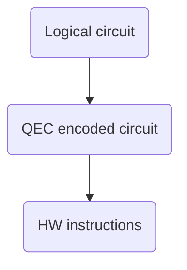

# qstack

qstack provides a scalable framework for developing multi-layer applications. Its main focus is fault-tolerant quantum software stacks.

Quantum programs typically require several layers of abstractions for easier programming. For example, at a minimum the layers of a fault-tolerant quantum software stack typically consist of:



- Logical circuit: Represents a quantum program using an idealized (error-free) set of standard instructions.
- QEC encoded circuit: Quantum hardware is inherently noisy (error-prone). To overcome this, quantum error correction (QEC) codes use multiple qubits to encode the data of a single qubit. They also provide fault-tolerant circuits capable of detecting errors and mimicking quantum instructions on the unencoded qubit. The set of quantum instructions implemented by fault-tolerant circuits become the instruction set of the QEC scheme.
- HW instructions: Each hardware has its own instruction set, depending on the underlying technology used to build the machine.

# Gadgets

The minimal unit of execution is a kernel. A kernel is comprised by a circuit, representing a list of instructions to run on a backend, and a decoder,

# Backends and Gadgets

A Backend defines a set of instructions and a runtime. Each gadget is comprise of a quantum circuit, a classical decoder, or both. A program consists of a list of invocation to gadgets.

Layers allow the transformation of a program with instructions for one backend into another.

## Innovations

- A formal definition for a Quantum Abstract Machine (QAM).
- Defining QEC schemas in terms of Quantum Abstract Machines.
- A new programming language capable of creating compilers for multi-layered quantum software stacks.
- A new ISA that focuses only on quantum operations. This focus allows for different instruction sets and the ability to programmatically translate between them. Removing the need to support classical computation simplifies the architecture.
- A streamlined Intermediate Representation (IR) for quantum circuits. A simple, human-readable, quantum circuits IR that simplifies their analysis and processing.

## No hybrid?

- Quantum computers are inefficient at performing individual classical computations.
- A QPU should function like a GPU: a separate processor unit that the CPU invokes for specific computations, with its own QISA.
- Hybrid models do not provide significant advantages, as classical and quantum computations cannot share memory or instructions.
- Therefore, our QISA focuses exclusively on quantum instructions. The classical component is limited to a set of classical registers used to store measurement outcomes and perform classically-controlled operations based on register values.
- In qstack all quantum computation is expressed in terms of a quantum circuit (or kernel) that the QPU needs to fully execute:
  - In this model, if a truly hybrid algorithm needs to execute, the quantum computation should be broken into multiple circuits that are sent for execution one at a time, the state of the qubits do not need to be reset between executions as such the classical computation can be performed between circuits.
  - The only classic component supported by our QISA is a set of classical registers used to store the outcome of measurements and to perform classically-controlled operations based on the value in the register. No classical computation, though.

## Tools enabled by this QISA

- A tool to create full-stack compilers for quantum circuits into specific HW instructions.
- A tool to formally verify quantum abstract machines.
- A tool to automatically calculate the noise model of QEC codes.
- Visualization tools for quantum circuits described in our new IR.

# Usage

To simulate a quantum circuit using a 'standard' quantum gate set:

```python
import qstack

circuit = qstack.load_program('circuit.ir')
qvm = qstack.load_machine('standard')
```

To compile the circuit from the standard instruction set
into the instruction set exposed by the 'c4' quantum error correction code:

```python
c4_qvm = qvm.target('c4')
c4_circuit = c4_qvm.compile(circuit)
```

To instead, compile the circuit directly into the instruction set
exposed by a specific hardware:

```python
hw_qvm = qvm.target('hw')
hw_circuit = hw_qvm.compile(circuit)
```

Optionally, compile into a a qvm that accepts a circuit that uses the standard
gate set, and generated instructions for hardware using the c4 encoding.

```python
hw_c4_qvm = qvm.target('standard').target('c4').target('hw')
hw_c4_circuit = hw_c4_qvm.compile(circuit)
```

Besides compilation, a qvm is capable of accepting a circuit and emulate it:

```
results = qvm.emulate(circuit, shots=100)
```

The instruction set of the input circuit must match the instruction set
of the qvm at the top of the stack.

```
c4_circuit = qvm.target('c4').compile(circuit)

c4_qvm = qstack.load_machine('c4')
results = c4_qvm.emulate(c4_circuit)
```

Besides compiling and emulating, qstack supports calculate the noise model of a
QEC code under a specific hardware. This noise model will then be automatically
used to emulate that target:

```python
c4_qvm = qstack.load_machine('c4')
hw_qvm = qstack.load_machine('hw')

noise_model = c4_qvm.calculate_noise_model(hw_qvm)
noise_model.save()
```

Finally, qstack provide support to verify that the fault tolerant circuit
of a scheme's gadgets match their formal matrix definition:

```python
c4_qvm = qstack.load_machine('c4').target('h4')
c4_qvm.verify()
```

# Resources:

"A Practical Quantum Instruction Set Architecture" (arXiv:1608.03355)[https://arxiv.org/abs/1608.03355]
