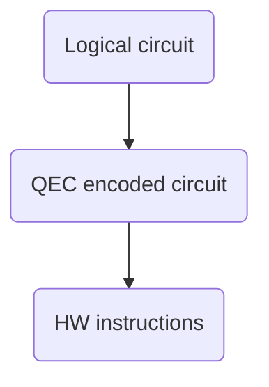

# qstack

qstack provides an scalable framework to describe and develop fault-tolerant quantum software stacks.

Quantum programs typical require several layer of abstractions to make them easier to program. The minimum layers of a fault-tolerant architecture consists of:



    * Logical circuit: represents a quantum program that uses an idealized (error-free) set of standard instructions.
    * QEC encoded circuit: Quantum hardware is inherently noisy (error-prone). To overcome this, quantum error correction codes use multiple qubits to encode the data of a single qubit. They also need to provide fault-tolerant circuits capable of detecting errors and manipulating the state in a way that mimics quantum instructions on the unencoded qubit. The set of quantum instructions implemented by fault-tolerant circuits become the instruction set of the qec scheme.
    * HW instructions: each hardware has its own set instruction set depending on the underlying technology used to build the machine.

## Innovations

    * A formal definition for a Quantum Abstract Machine (QAM).
    * Defining QEC schemas in terms of Quantum Abstract Machines.
    * A new programming language capable of creating compilers for multi-layered quantum software stacks.
    * A new ISA that focuses only on quantum operations.
      Why?    We need the flexibility to describe different instruction sets and the ability to programmatically translate from one to the other. Removing the need to support classical computation simplifies greatly the architecture. Hybrid computation is overrated (see next point).
    * A new streamlined Intermediate Representation for quantum programs.
      Why? We need simple quantum descriptions that make analysing and processing Quantum Programming Languages easier. Removing the need to support classical simplifies the IR as it can be modeled as a list of instructions. All existing quantum IRs (like QIR, QUIL, OpenQASM3, eQASM) are unnecessary complicated.


## No hybrid?
 * Quantum computers are not efficient at performing classical computations.
 * A QPU should be like a GPU: a seperate processor unit that the CPU can invoke to perform specific computations. It needs its own QISA.
 * In reality, not much is gained using a hybrid model as classical and quantum compute cannot share memory or instructions.
 * Therefore a QISA should focus exclusively on quantum instructions: adding classical computation to achieve a hybrid model is having to define a full classic ISA + a new ISA for quantum.
 * As such, our model is that all quantum computation is expressed in terms of a quantum circuit (or kernel) that the QPU needs to fully execute:
    - In this model, if a truly hybrid algorithm needs to execute, the quantum computation should be broken into multiple circuits that are sent for execution one at a time, the state of the qubits do not need to be reset between executions as such the classical computation can be performed between circuits.
    - The only classic component supported by our QISA is a set of classical registers used to store the outcome of measurements and to perform classically-controlled operations based on the value in the register. No classical computation, though.


## Tools enabled by this QISA

* A flexible full stack compiler for quantum circuits into HW instructions
* A tool to formally verify quantum abstract machines.
* A tool to automatically calculate the noise model of QEC codes.
* Visualization tools for quantum circuits described in our new IR


# Usage

To simulate a quantum circuit using a 'standard' quantum gate set:

```python
import qstack

circuit = qstack.load_program('circuit.ir')
qvm = qstack.load_machine('standard')
results = qvm.emulate(circuit)
```

To target the 'c4' quantum error correction code:
```python
c4_qvm = qvm.target('c4')
c4_circuit = c4_qvm.compile(circuit)
results = c4_qvm.emulate(c4_circuit)
```

To instead, target the circuit on a specific hardware:
```python
hw_qvm = qvm.target('hw')
hw_circuit = hw_qvm.compile(circuit)
results = hw_qvm.emulate(hw_circuit)
```


Or, target the circuit on a specific hardware:
```python
hw_qvm = qvm.target('hw')
hw_circuit = hw_qvm.compile(circuit)
results = hw_qvm.emulate(hw_circuit)
```


Optionally, we can create a qvm that accepts a logical circuit
but creates circuits that compiles and emulates circuits running on a
specific hardware using the c4 encoding.
```python
hw_qvm = qvm.target('standard.c4.hw')
circuit = qstack.load_program('circuit.ir')
results = hw_qvm.compile(circuit)
```


Calculate the noise model of a QEC code under a specific hardware.
```python
c4_qvm = qstack.load_machine('c4')
hw_qvm = qstack.load_machine('hw')

noise_model = qvm.calculate_noise_model(hw_qvm)
noise_model.save()
```


# Resources:

"A Practical Quantum Instruction Set Architecture" (arXiv:1608.03355)[https://arxiv.org/abs/1608.03355]


