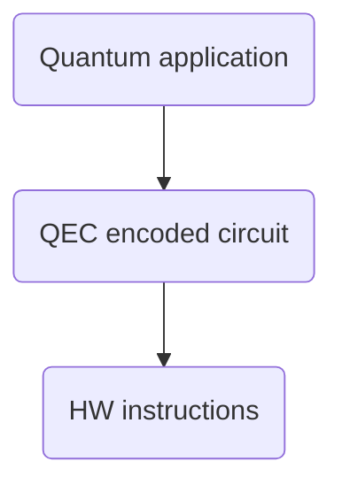

# qstack

qstack provides a flexible framework for developing multi-layer applications. Its main focus is fault-tolerant quantum software stacks.

Quantum programs typically require several layers of abstractions for easier programming. For example, at a minimum the layers of a fault-tolerant quantum software stack consist of:



- Quantum application: Represents the encoding of a quantum algorithm using an idealized (error-free) set of standard instructions.
- QEC encoded circuit: Quantum hardware is inherently noisy (error-prone). To overcome this, quantum error correction (QEC) codes use multiple qubits to encode the data of a single qubit. They also provide fault-tolerant circuits capable of detecting errors and mimicking quantum instructions on the unencoded qubit. The set of quantum instructions implemented by fault-tolerant circuits become the instruction set of the QEC scheme.
- HW instructions: Each hardware has its own instruction set, depending on the underlying technology used to build the machine.

With qstack it is possible to create these layers in a way that can be mixed and match. For example, we can create layers that represent different hardware providers and combine them with layers that represent different QEC schemas. Even more, different QEC layers can be combined to create concatenaded codes, which might improve the fidelities and can then be leverated by different quantum applications. A quantum application can be compiled to run either directly against quantum hardware, or first to a QEC encoding, which in turn can be compiled into specific HW instructions.

# Gadgets

The minimal unit of execution is a quantun gadget. A gadget is comprised by a quantum circuit -representing a list of instructions to run on a quantum backend- and a decoder -a classical program capable of interpreting the results reported by the quantum backend-.

Gadget definitions are layer independent, i.e. we use the same datastructures to define an instance of a gadget. This is achieved by having all layers follow the same architecture and use a common interface to represent quantum circuits and decoders.

## Quantum Circuits

A quantum circuit is specified as a list of instructions:

```
   circuit        ::= instructions
   instructions   ::= instruction
                    | instruction instructions
   instruction    ::= operation targets
   operation      ::= name
                    | name (parameters)
   parameters     ::= parameter
                    | parameter parameters
   targets        ::= target
                    | target targets
   target         ::= qubit
                    | $register
   name           ::= *id*
   qubit          ::= *id*
   register       ::= *id*
```

Each operation is identified by a unique name; some operations take parameters (for example, the angle of a rotation); all operations take one or more target ids. An operation target can be the id of a quantum bit (aka a qubit) or the id of a classical bit (aka a register). In code, classical register ids are identified with a "$".

The list of valid operations and their semantics are defined by each layer, as such, each gadget instance targets a specific layer.

## Decoders

A decoder is a function that given a list of classical registers, returns a new list of classical registers:

```
(bit list) -> (bit list)
```

It process the outcomes returned by evaluating a quantum circuit, and returns an updated list with the new evaluation.

# Layers

A layer is comprised of:

- An instruction set
- One or more compilers
- One or more backends

## Instruction sets

An instruction set is a list of instruction definitions:

```
  instruction_set           ::= instruction_definitions
  instruction_definitions   ::= instruction_definition
                              | instruction_definition  instruction_definitions
```

Each instruction definition consists of a list of names or aliases, a list of parameters, and a list of targets:

```
  instruction_definition    ::= name [aliases] (parameters) target_types
  aliases                   ::= name
                              | name, aliases
                            ::= \empty
                              | parameter
                              | parameter, parameters
  parameter                 ::= name:type
  type                      ::= int | float | complex
  target_types              ::= \empty
                              | target_type
                              | target_type target_types
  target                    ::= q
                              | r
```

## Compilers

Each layer defines one or multiple compilers. A compiler takes as input a quantum circuit or a gadget, and returns a new gadget targeted to this layer's instruction set:

```
(circuit | gadget) -> gadget
```

By default all layers offer a basic compiler that receives a quantum circuit; to be valid all the instructions in the circuit must be part of the layer's instruction set.

Each layer may also expose compilers that compile gadgets from other layers into its own instruction set.

## Backend

Each layer define one or more backends. A backend takes a gadget targeted for that layer and evaluates it.

(gadget) -> (bit list)

## Examples

A simple application layer may be comprised of this instruction set:

```
|0⟩ q
|1⟩ q
|random⟩ q
measure r q
```

A clifford layer may be comprised of this instruction set:

```
|0⟩ q
H q
S q
CX q
measure r q
```

The 3 qubit repetition code may expose this instruction set:

```
|0⟩ q
x q
z q
measure r q
```
