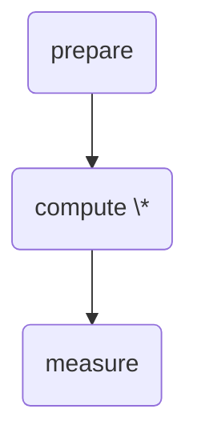
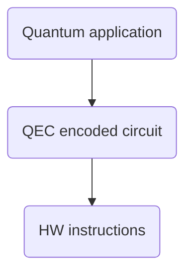

# Designing a Software Stack for Quantum Programs with Error Correction

Quantum processors differ fundamentally from classical computers. They leverage particles governed by quantum mechanics to perform computations using principles like superposition, entanglement, and interference. These properties allow quantum processors to perform certain tasks far more efficiently than classical computers. However, this efficiency comes at a cost: quantum computations are prone to extremely high error rates, which make long-running computations infeasible.

Error correction techniques, analogous to those used in long-distance communication, can mitigate this problem. The objective is to enable long-running quantum calculations by transparently integrating an error correction layer that reduces the error rate sufficiently to avoid computational failures.

# Key Challenges:

1. **Classical Computation in Error Correction:**  
   Error correction inherently involves **classical computation** —it requires real-time measurements and corrections based on classical logic. Designing a software stack that transparently incorporates this quantum error correction (qec) layer without introducing a fully hybrid language is a significant challenge. The stack must bridge the gap between quantum and classical processing seamlessly.

2. **Hardware and Code Dependence:**  
   Quantum processors typically offer a small, hardware-specific set of universal instructions from which all other operations can be derived. These instruction sets vary across hardware platforms, reflecting differences in the underlying quantum technologies. Similarly, quantum error correction codes define their own universal sets of instructions, which differ between codes. This diversity complicates the development of a universal software stack.

# The `qstack` approach:

With `qstack`, we propose a generic mechanism to define a layer of quantum processing. `qstack` introduces clear boundaries to support two key types of composition:

- **Horizontal Composition:** Enables the integration of quantum instructions, even when implemented using fault-tolerant circuits with real-time error correction.
- **Vertical Composition:** Allows layering to build concatenated error correction codes.

qstack is designed to be **platform-agnostic** and **qec code-agnostic**, providing flexibility to adapt to diverse hardware platforms and error correction strategies. This design ensures the stack can support scalable quantum computations while remaining transparent to the user.

## The QPU

At the lowest level of the stack is the Quantum Processing Unit (QPU). In `qstack`, the QPU is required to implement two methods:

- **`restart()`**: Resets the machine to a well-defined state, initializing all qubits.
- **`eval(instruction: Instruction) -> tuple[result]`**: Executes a single quantum instruction and returns its outcome.

## Instruction

An instruction represents a single quantum operation and consists of:

- **name**: Specifies the operation to perform.
- **targets**: A list of qubit IDs the instruction applies to.
- **parameters**: A list of parameters associated with the instruction.

## The Qubit Lifecycle



Qubits follow a defined lifecycle with three instruction types:

- **prepare**: Allocates and initializes a qubit with the specified id.
- **compute**: Modifies the state of one or more qubits.
- **measure**: Reads the value of a qubit and deallocates it.

### Rules of Qubit Usage:

- Each qubit is uniquely identified by an id.
- A qubit must be used in a **prepare** instruction exactly once.
- Once prepared, a qubit can undergo one or more **compute** instructions.
- A qubit must eventually be used in a single **measure** instruction, after which it is deallocated and can be reused by repeating the cycle.

## Evaluating instructions

Each QPU define its own list of instructions, but it must support at least one prepare (typically `reset`) and one measure (typically `mz`) instruction.

To evaluate instructions, the QPU must evaluate one instruction at a time. Validations that each qubit follows its lifecycle are made at the framework level.

# Gadgets

In `qstack`, gadgets are the minimal unit of execution.

```
   gadget         ::= prepare compute measure decoder
   prepare        ::= instructions
   compute        ::= instructions
   measure        ::= instructions
   instructions   ::= None
                    | instruction
                    | instruction instructions
   instruction    ::= gadget
                    | operation targets
   operation      ::= name
                    | name(parameters)
   parameters     ::= parameter
                    | parameter, parameters
   targets        ::= target
                    | target targets
   target         ::= *id*
   name           ::= *id*
   parameter      ::= int | float | str
   decoder        ::= None
                    | tuple[int] -> tuple[int]
```

Each gadget consists of three sets of instructions (**prepare**, **compute**, **measure**) and a **decoder**. At runtime, the instructions are executed in the following order:

1. **Prepare**: All prepare instructions are executed first to initialize qubits.
2. **Compute**: All compute instructions are executed to modify qubit states.
3. **Measure**: All measure instructions are executed to extract qubit values.

### Decoder

A decoder is an arbitrary classical function that processes the gadget's measurement outcomes. It takes a tuple of all measurements defined in the gadget and outputs a new tuple representing the gadget's final result. If a gadget does not have a decoder, the raw measurement outcomes are passed through as the gadget's output.

### Example: Bell Experiment Gadget

The following gadget prepares two qubits in a Bell state and returns their measurement outcomes:

```
gadget: bell experiment
- prepare:
  reset 0
  reset 1
- compute:
  h 0
  cx 0 1
- measure:
  mz 0
  mz 1
```

In this example:

- **Prepare**: Resets qubits 0 and 1 to a known state.
- **Compute**: Applies a Hadamard gate (`h`) to qubit 0 and a controlled-X gate (`cx`) from qubit 0 to qubit 1.
- **Measure**: Measures qubits 0 and 1 in the Z basis (`mz`).

# Layers and Encoding

In `qstack`, each **layer** defines its own instruction set by specifying a collection of gadgets.

### Encoding a Program

A program can be encoded into a layer by replacing all its instructions with corresponding gadgets. The layer is responsible for:

1. **Mapping Instructions to Gadgets**: Each instruction in the program must be translated into one or more gadgets defined by the layer.
2. **Execution Compatibility**: Ensuring the program's behavior is preserved through the mapping and execution process.

This mechanism allows for flexible abstraction and the integration of additional functionality, such as error correction or hardware-specific optimizations, without modifying the original program.

# OLD: qstack

qstack provides a flexible framework for developing multi-layer applications. Its main focus is fault-tolerant quantum software stacks.

Quantum programs typically require several layers of abstractions for easier programming. For example, at a minimum the layers of a fault-tolerant quantum software stack consist of:



- Quantum application: Represents the encoding of a quantum algorithm using an idealized (error-free) set of standard instructions.
- QEC encoded circuit: Quantum hardware is inherently noisy (error-prone). To overcome this, quantum error correction (QEC) codes use multiple qubits to encode the data of a single qubit. They also provide fault-tolerant circuits capable of detecting errors and mimicking quantum instructions on the unencoded qubit. The set of quantum instructions implemented by fault-tolerant circuits become the instruction set of the QEC scheme.
- HW instructions: Each hardware has its own instruction set, depending on the underlying technology used to build the machine.

With qstack it is possible to create these layers in a way that can be mixed and match. For example, we can create layers that represent different hardware providers and combine them with layers that represent different QEC schemas. Even more, different QEC layers can be combined to create concatenaded codes, which might improve the fidelities and can then be leverated by different quantum applications. A quantum application can be compiled to run either directly against quantum hardware, or first to a QEC encoding, which in turn can be compiled into specific HW instructions.

# Gadgets

The minimal unit of execution is a quantun gadget. A gadget is comprised by one or more quantum circuits -representing a list of instructions to run on a quantum backend- with a corresponding decoder -a classical program capable of interpreting the results reported by the quantum backend-.

There are two type of gadgets:

1. Data gadgets: responsible for allocating, preparing and measuring a quantum register.

2. Operation gadgets: responsible for updating the state of a quantum register.

Gadget definitions are layer independent, i.e. we use the same datastructures to define an instance of a gadget. This is achieved by having all layers follow the same architecture and use a common interface to represent quantum circuits and decoders.

## Data gadgets

## Quantum Circuits

A quantum circuit is specified as a list of instructions:

```
   circuit        ::= instructions
   instructions   ::= instruction
                    | instruction instructions
   instruction    ::= operation targets
   operation      ::= name
                    | name (parameters)
   parameters     ::= parameter
                    | parameter parameters
   targets        ::= target
                    | target targets
   target         ::= *id*
   name           ::= *id*
   register       ::= *id*
```

Each operation is identified by a unique name; some operations take parameters (for example, the angle of a rotation); all operations take one or more target ids. An operation target is the id of a quantum bit (aka a qubit).

The list of valid operations and their semantics are defined by each layer, as such, each gadget instance targets a specific layer.

## Decoders

A decoder is a function that given a list of classical registers, returns a new list of classical registers:

```
(bit list) -> (bit list)
```

It process the outcomes returned by evaluating a quantum circuit, and returns an updated list with the new evaluation.

# Layers

A layer is comprised of:

- An instruction set
- One or more compilers
- One or more backends

## Instruction sets

An instruction set is a list of instruction definitions:

```
  instruction_set           ::= instruction_definitions
  instruction_definitions   ::= instruction_definition
                              | instruction_definition  instruction_definitions
```

Each instruction definition consists of a list of names or aliases, a list of parameters, and a list of targets:

```
  instruction_definition    ::= name [aliases] (parameters) target_types
  aliases                   ::= name
                              | name, aliases
                            ::= \empty
                              | parameter
                              | parameter, parameters
  parameter                 ::= name:type
  type                      ::= int | float | complex
  target_types              ::= \empty
                              | target_type
                              | target_type target_types
  target                    ::= q
                              | r
```

## Compilers

Each layer defines one or multiple compilers. A compiler takes as input a quantum circuit or a gadget, and returns a new gadget targeted to this layer's instruction set:

```
(circuit | gadget) -> gadget
```

By default all layers offer a basic compiler that receives a quantum circuit; to be valid all the instructions in the circuit must be part of the layer's instruction set.

Each layer may also expose compilers that compile gadgets from other layers into its own instruction set.

## Backend

Each layer define one or more backends. A backend takes a gadget targeted for that layer and evaluates it.

(gadget) -> (bit list)

## Examples

A simple application layer may be comprised of this instruction set:

```
|0⟩ q
|1⟩ q
|random⟩ q
measure r q
```

A clifford layer may be comprised of this instruction set:

```
|0⟩ q
H q
S q
CX q
measure r q
```

The 3 qubit repetition code may expose this instruction set:

```
|0⟩ q
x q
z q
measure r q
```
