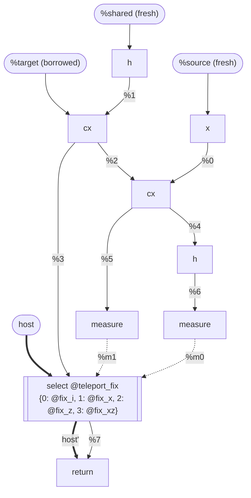
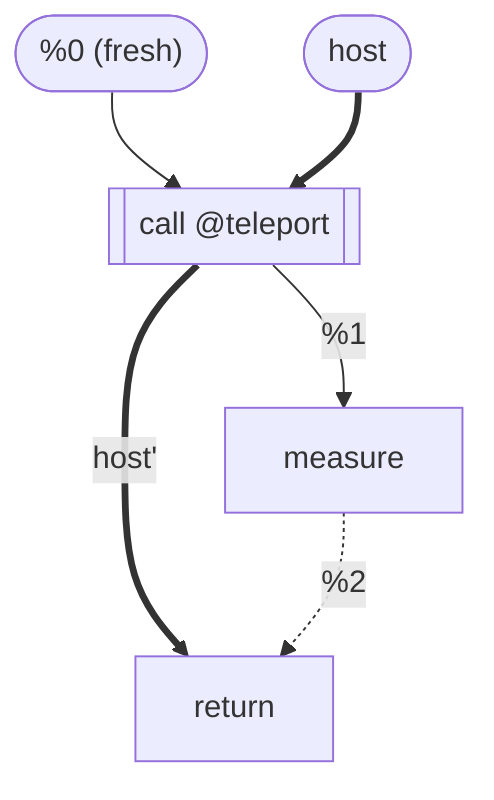
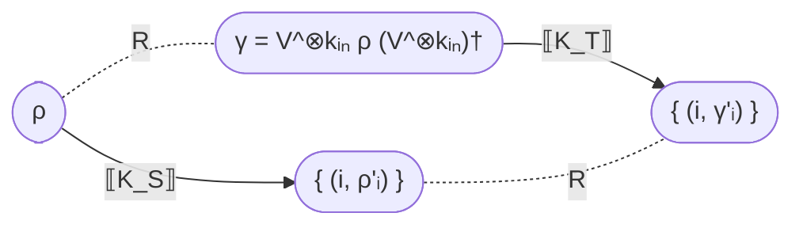

# Verifying qstack compiler passes

## 1. Goal and scope

qstack does not trust its compiler passes. Quantum programs are hard enough to validate that the compiler cannot be taken on faith, so every run of a pass produces a **witness**: a record of the transformation it performed. An independent verifier checks the source module, the target module, and the witness together; in the literature this is witness-carrying translation validation. Trust lives in the verifier, never in a pass. The executable language is the kernel-only IR specified in [`DESIGN.md`](DESIGN.md).

The goal is **semantic preservation**: for every fixed callback registry and initial host state for each callback source, the target (compiled) `@main` must behave like the source `@main`, read through the representation relation induced by the pass's declared encoding isometry. Throughout this document, **source** and **target** without qualification mean the pass input and its compiled output; a **callback source** is the namespace and host-state domain described in Section 2.3. The goal is not equality of IR: a pass may change representations, introduce internal measurements, widen target resources, and rewrite every unitary. The relation defines which externally visible behavior must survive.

Section 2 gives the semantic model, Section 3 the pass contract, Section 4 the checks, Section 5 what is deliberately deferred, and Section 6 the known limitations of the design.

### 1.1 Principles

- **P1. One semantic obligation.** Optimizations, QEC encodings, and dialect lowerings are all the same thing: preservation of the kernel's behavior modulo a representation relation.
- **P2. The pass is untrusted but cooperative.** A pass reports what it did, and everything it reports is checked before it is used. A false witness is refuted; one the verifier cannot check yields UNSUPPORTED. A witness affects what can be verified, never what counts as correct.
- **P3. Existing callbacks are interfaces.** A pass preserves every callback invocation in the source module, including its callback source and its order and multiplicity on that source's host wire, and never reasons about a callback's host implementation.
- **P4. New callback behavior is an obligation.** When a pass introduces a decoder or selector, the verifier derives the classical behavior it must have and reports it for a classical verifier to check.
- **P5. Rules are checked; kernels are composed.** Most quantum verifiers today compare the full source and target circuits for equivalence. qstack does not, for two reasons: a kernel's behavior depends on opaque callbacks, so it cannot be computed at all, and whole-program comparison grows exponentially with program size, so it does not scale. Instead the verifier checks that each small replacement preserves the semantics of the operation it replaces, and lifts those local results by composition to `@main`. Anything that does not arrive as such replacements is UNSUPPORTED, not guessed at.
- **P6. Failures are attributable.** A refutation names the rule, site, kernel, branch, or callback interface that failed.

### 1.2 Noiseless boundary

This document verifies noiseless semantics only. It claims no fault tolerance, noise resilience, threshold, or correct behavior under a noisy syndrome-extraction circuit.

An error tag on an introduced select case has a deliberately limited meaning: the case claims to correct a named error at a stated point. The tag is specified here and in `DESIGN.md` but not yet implemented; today `qstack.select` carries no such attribute. A later noisy design may add error distributions, reachability under faults, and fault-tolerance claims; none are part of the present correctness statement.

## 2. Semantic model

### 2.1 A program is a collection of named kernels

A program is a module containing a finite collection of named kernels and callback declarations. One kernel, `qstack.kernel @main`, is the program's distinguished entry point.

`qstack.call` and `qstack.select` refer to other named kernels. Every invocation target is named in the symbol table; there are no function values or indirect calls, so every kernel reachable from `@main` is statically known.

Semantically, a kernel maps an input quantum state to one output quantum state for each possible returned bitstring. If `K` returns `m` bits, write:

```
⟦K⟧(ρ) = { (b, ρ_b) | b ∈ {0,1}^m }
```

Here `ρ` is the state of the kernel's input qubits and `ρ_b` is the subnormalized state of its returned qubits for outcome `b`. The trace of `ρ_b` is the probability that the kernel returns `b`. Different returned bitstrings may correspond to different quantum states; this correlation is part of the kernel's meaning. A map of this kind is commonly called a **quantum instrument**.

Fresh qubits allocated by the kernel begin in `|0⟩`. Only measurement results returned by the kernel appear in `b`; measurements consumed inside the kernel still affect the probabilities and output states but are not themselves observable results.

The instrument of a kernel is determined by its fresh-qubit allocation and by the operations in its body, including unitaries, measurements, decodes, calls, and selects. A `qstack.call` incorporates the instrument of its callee, while a `qstack.select` incorporates the instrument of the selected case kernel. The instrument denoted by `@main` is the meaning of the program. Because `@main` returns no qubits, its output quantum state belongs to the one-dimensional Hilbert space of zero qubits. For each returned bitstring `b`, the corresponding subnormalized state is the `1 × 1` matrix `[p_b]`, whose trace is the probability `p_b`. Thus the instrument of `@main` is a probability distribution over its returned bitstrings.

### 2.2 A kernel is a dataflow graph

Each kernel body forms a separate dataflow graph. The program is therefore a collection of kernel graphs. Verification compares each source kernel graph with its corresponding target kernel graph independently.

This graph view is not a new representation: linearity gives every qubit and bit value exactly one producer and one consumer, so the graph is already present in the kernel body, written down in sequence form.

The operations are the nodes; the SSA values are the wires. The sources are the borrowed inputs and the fresh `|0⟩` qubits; the sink is `qstack.return`. A `qstack.measure` is an interior node where a qubit wire ends and a bit wire begins. A `qstack.call` is a single opaque node; the callee's internals are not part of the caller's graph. A `qstack.select` references its case kernels, each a graph of its own.

Two kernel bodies are the same kernel when their graphs match: same nodes, symbols, attributes, and wiring. In particular, the order of two operations connected by no wire is not part of the kernel graph. This is safe in the noiseless model, where operations on disjoint qubits commute: emitting them in either order produces the same graph. Order matters only where a wire carries it, and one more wire is needed for the order that matters to callbacks.

### 2.3 Callback sources and host wires

Every selector and decoder belongs to a **callback source**, which identifies both a namespace and a host-state domain. An absent `source` attribute denotes the empty source used by callbacks in the original program; these callbacks keep their unqualified names. A compiler-created source has the form `family.layer`: for example, `@rep3.1:decode` has source `rep3.1`, but resolves to the shared implementation `rep3:decode`. Later layers use `rep3.2` through `rep3.n`. Layers share the implementation, not its state; when needed, source-local state is passed separately.

Callbacks with the same source may share deterministic state, while callbacks with different sources cannot observe one another's state. Their implementations remain opaque to the compiler. Each source is represented in the kernel graph by one implicit **host wire**. A `decode` or `select` threads its source's wire, and a call threads every wire used transitively by its callee. The sequence on a wire records the order of callbacks that may share state; callbacks on different wires need no additional ordering unless connected by ordinary dataflow.

A pass preserves each existing callback's source, qualified name, interface, bit operands, reachability, multiplicity, and position on its host wire. Because the same deterministic implementation receives the same bits in the same source-local state, it produces the same result and state transition. A callback introduced by a pass instead uses a fresh source and carries the classical obligations of Sections 3.3 and 4.3. That source is retained by later passes, so the new host-state domain remains separate from earlier ones.

**Example: teleportation.** The module below teleports the state of a fresh qubit onto a borrowed one: `@teleport` prepares the state to send, entangles, measures both of its fresh qubits, and asks the host which Pauli fix to apply. It parses and verifies as written.

```mlir
builtin.module {
  qstack.selector @teleport_fix arity 2
  qstack.kernel @fix_i <[!qstack.qubit], [!qstack.qubit]> allocates 0 {
  ^bb0(%0: !qstack.qubit):
    qstack.return %0 : !qstack.qubit
  }
  qstack.kernel @fix_x <[!qstack.qubit], [!qstack.qubit]> allocates 0 {
  ^bb0(%0: !qstack.qubit):
    %1 = cliffords.x %0
    qstack.return %1 : !qstack.qubit
  }
  qstack.kernel @fix_z <[!qstack.qubit], [!qstack.qubit]> allocates 0 {
  ^bb0(%0: !qstack.qubit):
    %1 = cliffords.z %0
    qstack.return %1 : !qstack.qubit
  }
  qstack.kernel @fix_xz <[!qstack.qubit], [!qstack.qubit]> allocates 0 {
  ^bb0(%0: !qstack.qubit):
    %1 = cliffords.x %0
    %2 = cliffords.z %1
    qstack.return %2 : !qstack.qubit
  }
  qstack.kernel @teleport <[!qstack.qubit], [!qstack.qubit]> allocates 2 {
  ^bb0(%target: !qstack.qubit, %shared: !qstack.qubit, %source: !qstack.qubit):
    %0 = cliffords.x %source
    %1 = cliffords.h %shared
    %2, %3 = cliffords.cx %1, %target
    %4, %5 = cliffords.cx %0, %2
    %6 = cliffords.h %4
    %m0 = qstack.measure %6
    %m1 = qstack.measure %5
    %7 = qstack.select @teleport_fix(%m0, %m1) [%3] {"0" = @fix_i, "1" = @fix_x, "2" = @fix_z, "3" = @fix_xz} : (!qstack.qubit) -> !qstack.qubit
    qstack.return %7 : !qstack.qubit
  }
  qstack.kernel @main <[], [!qstack.bit]> allocates 1 {
  ^bb0(%0: !qstack.qubit):
    %1 = qstack.call @teleport(%0) : (!qstack.qubit) -> !qstack.qubit
    %2 = qstack.measure %1
    qstack.return %2 : !qstack.bit
  }
}
```

The graph reading of `@teleport`, with qubit wires solid, bit wires dotted, the empty-source host wire bold, and host nodes drawn with a double border:



And the graph of `@main`, where the host node is the call, because its callee reaches `@teleport_fix`:



The graphs make the model concrete:

- The sources of `@teleport` are the borrowed `%target`, the two fresh qubits, and the incoming host state; the sink is the return, which the host wire also leaves through.
- `x` and `h` share no wire, and neither do the two measures: their relative order is not part of the program, and a pass may emit either first.
- Each measure ends a qubit wire and starts a bit wire. Both bit wires flow into the select, so no measurement outcome leaves the kernel.
- The select is the kernel's only host node. Its case kernels are separate graphs referenced by label: `@fix_x` is a single `x` node between its borrowed input and its return.
- In `@main`, the call is an opaque node on the host wire while the final measure stays off it. A pass that moved or dropped the select would change the host wire's shape and be refuted; a pass that emitted the two measures in the other order would produce the same `@teleport` graph, which is no change at all.

### 2.4 Host interfaces and kernel boundaries

A program exposes behavior to the host in two places: when it delivers bits to a callback, and when `@main` returns its bit results. These are the program's **host interfaces**. At these points, target bits must equal the corresponding source bits. Existing callbacks must also preserve the symbol, declaration, bit arity and operand order, case map, order, multiplicity, and reachability required by Section 2.3. `@main` never returns qubits.

A call from one kernel to another is not a host interface. Its arguments and results remain internal to the qstack program, and the compiler may change their representation. For example, a source call that passes one qubit may become a target call that passes an encoded block of qubits. No host code observes that change.

Kernel boundaries are nevertheless **verification boundaries**. Because each source-target kernel pair is verified independently, their signatures must correspond through the representation relation: source and target qubit tuples are related by the pass's encoding applied to the appropriate representation units, while their bits are equal under `R_bit`. This allows the verifier to use a callee's result when checking its caller without inspecting the callee's graph.

A pass may therefore change internal measurement, encoding, and decoding plumbing, provided that:

- each kernel pair satisfies the representation relation at its signature;
- every existing callback receives the corresponding source bits; and
- `@main` returns the same externally visible bits.

### 2.5 The correctness statement

A pass declares one encoding isometry `V`, from the state space of an ordered source representation unit of `M` qubits to that of an ordered target unit of `N` qubits. This covers a one-to-one representation on distinct wire identities, a one-to-many code block, and a general `M`-to-`N` encoding. A pass that preserves representation declares the identity isometry. Each claim records which source and target wires instantiate the pass's fixed representation units.

Together with equality on bits, this encoding induces the **representation relation** used below. For a source tuple state `ρ_S` and its corresponding target tuple state `ρ_T`, the quantum relation induced by `V` is:

```
R_V(ρ_S, ρ_T)  iff  ρ_T = V ρ_S V†.
```

Thus the target state must lie in the image of `V`. Bits use the same relation in every pass:

```
R_bit(b_S, b_T)  iff  b_S = b_T.
```

Bits use equality because existing callbacks are opaque: changing a bit could change callback behavior. Thus every pre-existing callback must receive exactly the source bit tuple, and independent kernel checks require the same equality at every kernel boundary. Internal target measurement bits must be decoded back to this equality before crossing one.

At a kernel boundary containing `k` independent representation units, the induced encoding is `V^⊗k`. This is one pass-level `V` applied once per representation unit, not one separately declared isometry per wire or claim. It applies to the complete joint state, preserving correlations and entanglement.

#### Kernel behavior by outcome

A kernel that receives state `ρ` produces the outcome-indexed family described in Section 2.1. For each possible tuple `i` of returned bits, the family contains the corresponding subnormalized state `ρ'_i` of the returned qubits:

```
⟦K⟧ : ρ ↦ { (i, ρ'_i) }
```

The trace of `ρ'_i` is the probability of outcome `i`, and the traces of all outcome components sum to one. Measurement results consumed inside the kernel by `decode` or `select` do not appear in `i`; their effects are already included in the outcome components.

#### When two kernels are related

Run the source kernel `K_S` on `ρ`. If its input contains `k_in` representation units, run the target kernel `K_T` on the related input `γ = V^⊗k_in ρ (V^⊗k_in)†`:



Both kernels must return bits with the same arity and meaning, so their outcome-indexed families use the same index `i`. The target kernel's internal decoders ensure that `i` contains source-equivalent bits, not raw target measurement results.

The kernels are related if, for every input `ρ` and every returned-bit outcome `i`:

```
γ'_i  =  V^⊗k_out ρ'_i (V^⊗k_out)†
```

Here `k_out` is the number of returned representation units. In words: for each classical outcome, the target kernel's remaining quantum state must represent the source state through the pass's encoding. Because an isometry preserves trace, the two kernels also assign the same probability to that outcome.

This one equation preserves all externally visible behavior:

- returned bits have the same values and probabilities;
- the quantum state associated with each returned-bit outcome is preserved through the encoding;
- correlations among returned bits and qubits are preserved;
- callers, case maps, callbacks, and `@main` can use target results without translation; and
- pre-existing callbacks receive identical bits in the same order on each callback source's host wire, so they produce the same results and host-state evolution under Section 2.3.

The statement also covers consumed borrowed qubits and escaping fresh qubits because each `ρ'_i` contains exactly the qubit results declared by the kernel. Borrowed bits select which outcome-indexed family applies, so the equation must hold for every pair of related borrowed-bit assignments.

#### Encoded measurement and decoder obligations

The bit relation is equality, including at a measurement boundary. When a pass replaces source measurement with measurements of the represented target tuple, the target's raw measurement bits are internal. A fresh opaque decoder must turn them into the source-level bit or bit tuple that would have left the source measurement. The verifier derives this finite classical requirement from the measurement identity claim and reports it as an obligation; a classical verifier checks the registered decoder implementation. The decoder's required map is therefore not part of the representation relation or its declaration. For the three-qubit repetition encoding, the derived requirement is majority vote.

#### What the verifier checks

The commuting square above defines correctness; it is not the algorithm used to check a pass. The verifier cannot compute `⟦K_S⟧` or `⟦K_T⟧` directly because kernel behavior depends on opaque callback implementations, and correctness must hold for every callback registry.

Instead, the verifier checks that each witnessed replacement has the same local effect as the fragment it replaces (Sections 4.1 and 4.2), checks that every existing host wire is preserved (Section 2.3), and proves that those local facts compose into the square (Section 4.4).

## 3. The pass contract

### 3.1 The witness

A pass emits, alongside its target module, a witness containing:

1. its **encoding isometry**: the pass's single `V`, including the identity isometry for a same-representation pass;
2. the **rules** its sub-graph claims reference (Section 3.2);
3. the **claims**: an explicit claim identifier and claim kind for every node of the source and target modules, with the source and target regions of each claim recorded as one pair; and
4. each claim's **arguments**, such as an inline's callee or a correction case's error tags.

The witness is bookkeeping a rewrite driver records as it applies each claim, so pass authors do not write witnesses by hand. This sets the scope deliberately: qstack verifies passes built on its own pass framework, cooperative but untrusted, and does not try to reconstruct what an uninstrumented third-party pass did from the source and target modules alone.

A pass applies everything in one shot through its induced relation: an encoding pass applies its unitary implementations together with the relation's measurement and allocation checks, and no intermediate module ever exists to be valid or invalid. Verification sees the source module, the target module, and the witness.

A pass transforms the program kernel by kernel. The unit of compilation and verification is a pair of source and target kernel graphs, not one whole-program graph. The verifier checks each pair independently: a call remains an opaque node in the caller's graph, while its callee pair is verified separately. Section 4.4 then composes the per-kernel results into the end-to-end claim about `@main`.

This independence restricts a call to exactly two replacements: inline it, or preserve the call with the callee's transformed signature. Any other rewrite of a call would tie the caller's check to the callee's internals.

### 3.2 Claims

Every node of the source and target modules belongs explicitly to exactly one claim. Each claim has one identifier whose source and target regions are recorded together; every node in either region carries that identifier in the witness. The one-to-one correspondence is between these paired claim occurrences, not between their nodes: one source operation may correspond to a target region containing several operations. A claim kind states how the pair was transformed and determines its check. There are three executable-region kinds today: identity, inline, and sub-graph; allocation has the explicit boundary claim described below because it is not an operation node. The vocabulary is closed but extensible: a new claim kind, classical claims included, needs a defined check before any pass may use it (Section 5). Not every verifier backend can check every claim; Section 4.1 describes how backends are tried.

There is no default claim. An untagged node, a node carrying more than one claim identifier, an unknown identifier, or a claim whose recorded regions do not agree with the tags makes the witness malformed and is REFUTED. A claim may have an empty region only where its kind explicitly permits one, as when a sub-graph optimization deletes operations; the empty region is still present in the paired claim record.

**Identity.** Identity means **relational identity**, not necessarily node-for-node syntactic identity. An identity claim says that one source operation and its paired target region are the same logical operation through `R_V` and `R_bit`. The source region therefore contains exactly one operation, while under a non-identity encoding the target region may contain one or many: one logical unitary may be implemented by a region of physical unitaries, and one logical measurement is implemented by measurements of its represented tuple followed by a decoder. When the pass declares the identity representation relation, an identity claim is the degenerate case and requires one corresponding target operation; a lowering to a different operation or region uses a sub-graph claim.

Identity is checked intentionally for every executable operation kind:

- A **unitary** identity claim checks the target region as the encoded implementation of the one source unitary: if its net action is `U_T`, then `U_T V^⊗k_in = V^⊗k_out U_S`. Under a non-identity encoding, the target region may use the same internal measurement-and-fresh-selector structure allowed for a rule, with every reachable branch implementing this equation.
- A **`measure`** identity claim consumes the target tuple representing the source qubit, measures that tuple, and passes the raw target bits to one fresh `decode`. Its one escaping bit must equal the source measurement result. This is the measurement shape supplied by the relation, and it produces the decoder obligation in Section 4.3. Thus measurement is not exceptional because one operation expands to a region—unitaries do that too—but because the region must restore a source-level classical value.
- A pre-existing **`decode`** identity claim contains one corresponding target `decode` and preserves its callback source, symbol, arity, and bit operand order. Its operands and result are equal through `R_bit`.
- A **`call`** identity claim contains one corresponding target call, keeps its callee, and relates the widened arguments and results through the independently checked callee pair (Section 4.4).
- A pre-existing **`select`** identity claim contains one corresponding target `select` and preserves its callback source, symbol, arity, bit operand order, and case map. Its case arguments and results may widen through `V`, and each case kernel is related to the kernel named by the same label.
- A **`return`** identity claim contains one corresponding target return. It returns corresponding values, with qubit tuples related by the appropriate tensor power of `V` and bits by `R_bit`.

Case kernel bodies and signatures may be transformed by their own explicitly tagged claims, but the callback-visible interface does not change. Allocation is not an executable operation node—fresh qubits are kernel entry values—so it is covered by the explicit allocation claim described below rather than by an operation identity claim.

**Inline.** A call replaced by a copy of the callee's source body: arguments substituted for the borrowed entry values, SSA names renamed fresh, and the callee's `allocates` merged into the caller's. The check is purely syntactic, because a direct call already denotes the callee's instrument at that point. Inlining is exact substitution, so any callee qualifies, including one that measures or invokes callbacks: the copied callback uses execute exactly when the call would have, keeping every host wire intact. A pass that wants to rewrite across a call boundary inlines first and rewrites the copy in a second pass; the module between the two passes is an ordinary valid program. Because the copy is verbatim, inlining under a non-identity relation cannot typecheck (a source-representation copy cannot wire into target-representation surroundings), so inlining happens before the encoding pass or after it. A callee left unreachable may be dropped. Outlining, the inverse, has no claim type (Section 3.4).

**Sub-graph.** A sub-graph claim says that a source region was transformed by a rule rather than preserved operation by operation through an encoding. This is the claim for optimizations such as combining `S;S` into `Z` and for dialect lowering under the identity representation relation. The encoded implementation of one source operation under a non-identity relation instead uses relational identity, even when its target implementation is a region. The rule and the claim play different roles:

- The **rule** is a reusable description of a permitted rewrite. It is written as a pair of small kernels: one source body and one target body, with signatures corresponding through the representation relation. These kernels are proof artifacts, not kernels invoked by the program.
- The **claim** records one concrete use of that rule. It names the source and target nodes at the replacement site and the wire renaming that makes those nodes match the rule.

The verifier checks the rule semantically once, then checks each claim by matching its nodes and wires against that rule. Many claims can therefore reuse one rule without repeating its semantic check. Writing rules as kernels also reuses the parser, linearity checks, and signature syntax already used for program kernels.

The source and target rule bodies must have the same effect through the relation. Writing `U_S` and `U_T` for their net actions, a rule with `k_in` input and `k_out` output representation units must satisfy:

```
U_T V^⊗k_in = V^⊗k_out U_S
```

For an identity relation, this is ordinary unitary equality. A rule may, for example, replace `S;S` with `Z`. Under the three-qubit repetition relation, the operation-wise replacement of one source `X` by one target `X` on each of the three corresponding target wires is instead a relational identity claim. Its implementation is checked by the same equation and may be cached and reused just like a rule check.

An ordinary rule's source body contains only unitaries. Its target body may allocate ancillas, measure them, and drive one fresh select, provided that no bit leaves the rule and every reachable execution path still implements `U_S` through the relation. A unitary identity implementation has the same permitted target shape. T-injection has this shape: the target measures a prepared ancilla and uses a fresh selector to apply the correction that makes every reachable outcome implement `T`. A tagged unreachable correction case is checked by its correction identity instead (Section 4.3).

A rule body never contains a call or a pre-existing callback. A call must be inlined before a rule can see the callee's operations, and C1 keeps existing callbacks outside sub-graph claims. Rules are concrete: gate angles and other parameters are actual attributes from the site, not symbolic variables.

**The relation's endpoint checks.** Identity implementations and ordinary sub-graph rules describe computations on wires that already exist. A non-identity encoding must also account for where a representation unit begins and ends. The pass does not write these checks.

The **allocation claim** establishes the relation when a fresh source representation unit is created. The target allocates the corresponding target unit and prepares it as `V|0…0⟩`. Allocation lives in the kernel's entry block rather than in an operation, but it still needs an explicit paired claim because the pass must account for the preparation of every represented fresh unit.

The **measurement identity check** recovers the source observable when a represented target tuple is measured. It checks the source measurement against target measurements followed by a fresh decode:

```
source:  measure one qubit ──────────────────────────────→ one bit
target:  measure the target tuple → fresh decode ────────→ one bit
```

The raw target measurement results remain inside the identity region. The bit that leaves must equal the source measurement result. The fresh `qstack.decoder` callback remains opaque; the verifier derives and reports the finite behavior it must have for classical discharge under Section 4.3. This is the only identity or sub-graph shape that hands out a newly created bit, which keeps `R_bit` equal at every kernel and host boundary.

For example, an encoded transformation of

```
allocate → X → measure → return
```

is covered by four explicit claims: the relation's allocation claim prepares the target block, a relational identity claim implements `X`, a measurement identity claim measures and decodes the block, and a return identity claim preserves the boundary. The identity claims explain the operation-wise computation inside and out of the representation; the allocation claim establishes that representation for the fresh unit. Under an identity representation relation these claims are still explicit, although their paired regions are normally one node on each side and allocation needs no separate preparation.

Two asymmetries keep these claims sound. A target implementation or rule may introduce measurements because measurements carry no hidden host state, but it may not introduce a use of a pre-existing callback, which may be stateful. And except for a measurement identity claim, every claim must consume any bits it creates.

### 3.3 Callback conditions

Conditions on the witness; Section 4 rejects one that violates them.

- **C1. Existing callbacks are untouchable.** Every pre-existing `decode` and `select` node belongs to an identity claim or an inline copy, and to nothing else. No rule contains a pre-existing callback, so no sub-graph claim can touch one. Its declaration, including the value or absence of its `source` attribute, is preserved. Case kernel bodies may be transformed, but the callback-visible case map does not change, and the callback is not reverified.
- **C2. A new decode appears only in a measurement identity claim.** Its output stands for the source measurement's bit. A decode is never introduced to pre-process bits for an introduced selector: a selector is an arbitrary function of its bits, so that computation belongs inside it, keeping each introduced callback's obligation standalone. The declaration and every new use are fresh relative to the source module.
- **C3. A new select appears only inside a unitary identity implementation or a sub-graph rule's target region.** Its selector declaration and use are fresh. A case reachable in the noiseless semantics is justified by the implementation or rule's branch check; an unreachable case, as a QEC correction case is, carries an error tag naming the error it claims to correct (a tag for an error at another point must state that point) and is checked by its correction identity. Once introduced, the selector and its cases are fixed: later passes preserve them under C1 like any other callback.
- **C4. Introduced bits are internal.** Bits created for a new decoder or selector must not reach a pre-existing callback or a `@main` result without an explicit relation restoring the source observable. A transformation may not add a new opaque classical interface.
- **C5. Introduced callback sources are fresh.** Every introduced callback declaration has an explicit, nonempty callback source absent from the source module. Callbacks introduced together may share a fresh source only when their stateful behavior is covered by one joint classical obligation; otherwise their sources are distinct. Runtime state is partitioned by callback source, so a new source cannot perturb the state carried by an existing host wire.

### 3.4 Transformations outside the contract

A transformation that has a complete witness but whose claim kind or semantic obligation the verifier cannot check gets UNSUPPORTED rather than a refutation. Today that includes outlining a fragment into a new kernel (the inverse of inlining, with no claim kind yet) and any rewrite of a source region containing a measurement or pre-existing callback other than the operation-wise identity shapes above. Reordering two operations connected by no wire is not on this list, because it is not a transformation: the source and target modules have the same graph. Moving a pre-existing callback along its host wire or changing its callback source is a shape change and is refuted. The verifier never searches for unwitnessed correspondences: a node or rewrite absent from the claims makes the witness malformed and is REFUTED, even if the transformation happens to be correct.

**Example: Pauli-frame tracking.** An encoding pass may try to defer Pauli corrections into later measurement decoding instead of materializing them with `qstack.select`. The current relation cannot represent the tracked frame, so such a transformation is UNSUPPORTED; it requires the frame-enriched qubit relation deferred in Section 5. A later pass also cannot remove an already materialized correction select: doing so changes its host wire and is REFUTED.

## 4. How verification checks the witness

### 4.1 Checking identity implementations and rules

Before a unitary identity implementation or a sub-graph rule can justify a claim, the verifier checks the semantic obligation from Section 3.2. For identity, `U_S` is the action of its one source operation; for a sub-graph rule, it is the net action of the rule's source body. In both cases the verifier checks `U_T V^⊗k_in = V^⊗k_out U_S`, using gate matrices supplied by the dialect definitions. Distinct identity regions are checked independently, while repeated normalized source-operation/target-region shapes may reuse a cached result.

If the target region performs internal measurements, the verifier checks every reachable outcome separately. Each outcome must implement the same source action through the relation. This check also derives the outcome-to-case behavior required of a fresh selector. Tagged unreachable correction cases are checked separately under Section 4.3.

To discharge these obligations, the verifier tries the available backends in turn: dense matrices for small regions, stabilizer methods for Clifford regions, and external equivalence checkers for larger ones. A backend either verifies, refutes, or declines. The first definitive answer wins: a verification from any sound backend suffices, a refutation is final and refutes the pass no matter how many claims reuse the result, and if every backend declines, the result is UNSUPPORTED, naming the identity implementation or rule. Some backends need the relation in a specific form, such as an encoding given by its stabilizer generators; that side data and the integration API are deferred (Section 5).

### 4.2 Checking the claims

The claims are checked structurally against both graphs:

1. **Explicit partition.** Every node of the source and target modules carries exactly one known claim identifier, every identifier resolves to one paired claim record, and the record lists exactly the nodes carrying it. There is no identity fallback and no node is shared.
2. **Sites.** Each multi-node identity or sub-graph region holds together: no path leaves the region and re-enters it through an outside node. This is what lets the region stand alone as one action.
3. **Instantiation.** A unitary identity region has exactly one source operation and the target boundary used by its semantic check; a measurement identity has the measure-tuple-decode shape above; and structural identity claims satisfy the per-operation conditions in Section 3.2. Each sub-graph site matches its rule's source body up to wire renaming, and its replacement matches the target body under the same renaming. An inline's copy must be the callee's source body with arguments substituted and names renamed. Freshness (C2, C3, C5) is checked against the source module's callback sources and symbols.
4. **Claim boundaries and host wires.** The wiring between paired claims must correspond through `R_V` and `R_bit`; the sequence of pre-existing callback nodes on every existing host wire is identical on both sides; and introduced callbacks appear only on fresh host wires inside the claims that own them. After checking the claims, no remainder exists on either graph.

These checks are structural; Section 4.1 discharges the semantic obligations they identify. A witness that makes a false statement, such as a site that does not match its rule, or that is silent about any node or changed region, is REFUTED. The failure names the claim, site, or node.

### 4.3 Derived classical obligations

An introduced callback's required behavior is derived from the quantum relation, never trusted (P4).

For a decoder introduced by a measurement identity claim, the verifier does not execute or inspect the implementation. It derives and reports a finite obligation: the callback source, qualified declaration symbol, and shared implementation key; the input layout; the reachable input tuples in the noiseless relation; the required output for each; and any explicitly unconstrained tuples. A classical verifier checks the registered decoder against it; until then, the quantum result is verified modulo the reported obligation.

For a selector introduced by a unitary identity implementation or a sub-graph rule, the verifier derives the outcome-to-case behavior required on every reachable branch (Section 4.1) and checks each tagged unreachable case at its declared point. For an error `E` occurring after a replaced operation `U`, the correction case kernel `C_E` must satisfy:

```
C_E E U = U
```

Equivalently, `C_E E = I` on the image of the code space where `E` occurs; a tag naming an error at another point uses the correspondingly conjugated relation. From the measurement structure and the tags, the verifier then reports the finite syndrome-to-case behavior required of the selector, together with its callback source, qualified declaration symbol, and shared implementation key, for a classical verifier to check against the registered implementation.

When several callbacks share a fresh source such as `rep3.1`, their per-callback requirements form one joint classical obligation. That obligation follows their ordered invocations on the source's host wire and accounts for any state they share. Giving each callback a distinct source avoids this joint reasoning.

### 4.4 Composition

The end-to-end claim rests on these facts:

- **Local composition.** Related replacements compose sequentially, so an introduced decoder or selector is justified at its site rather than against an enclosing kernel.
- **Kernel calls.** If a callee pair is related, the corresponding target call preserves the caller's relation.
- **Kernel composition.** If all claims in a kernel are related and every existing host wire is preserved, the source and target kernels are related.
- **Root adequacy.** If every reachable kernel pair is related, all pre-existing callback uses and sources are preserved, and every added obligation is discharged, the source and target `@main` are related for the fixed registry and initial state of each callback source.

These rely on linearity and the host wires: together they leave no unaccounted wires, copies, discards, or unordered host interactions within a callback source.

### 4.5 Verdicts and obligation handoff

Quantum verification produces one of:

- **VERIFIED**: all quantum obligations discharged, no classical obligations generated;
- **VERIFIED MODULO CLASSICAL OBLIGATIONS**, with the finite decoder and/or selector contracts still to be checked;
- **REFUTED**, naming the failing rule, site, kernel, branch, relation, or callback interface; or
- **UNSUPPORTED**, when a rule exceeds every backend or the transformation lies outside what the witness can express.

The handoff to a classical verifier is part of the design boundary; its data format and integration APIs are not fixed here.

## 5. Deliberately deferred

This document does not yet choose:

- concrete rule-checking backends and the API that selects one per rule, including per-backend side data such as an encoding given by its stabilizer generators;
- the witness serialization: rule format, claim encoding, claim arguments;
- additional claim types beyond identity, inline, and sub-graph, including classical claims over the decode and select structure;
- the classical obligation data structure and pass-manager integration;
- an API through which a pass declares its encoding isometry or error tags;
- channel-valued rules: rules whose source body contains a measurement, or whose bodies denote an instrument rather than a single unitary, checked as channel equivalence; today the source body is unitary, every declared rule denotes one unitary, and a source measurement whose bit must survive is owned operation-wise by a measurement identity claim;
- kernel summaries: a call to a transitively unitary, non-recursive kernel summarized by its unitary, letting the call join a rule site without inlining first;
- the frame-enriched qubit relation for encoding passes that track Pauli frames instead of materializing corrections;
- relational obligations for trace-changing rewrites, all of one shape: a subgraph of pre-existing callbacks is replaced by fresh ones, with the obligation that the two are equal as functions of the removed symbols and a statelessness requirement on each removed callback. Correction-select removal is the instance with quantum content (yielding `decoder(s, m) = m ⊕ flip(fix(s))` by conjugating each case's Pauli through the intervening Cliffords); fusing stacked decode chains and select towers is purely classical. Section 2.3 forbids all such trace changes today; or
- noisy and fault-tolerance verification.

Those are implementation-planning work after this document and `DESIGN.md` have been reviewed together.

## 6. Known limitations

These are downsides of the architecture itself, not missing features: each one is the price of a decision this document defends, and the first three can be softened while the last cannot.

- **Calls are optimization fences.** A rewrite spanning a call boundary, such as a gate at the end of a callee cancelling a gate after the call site, is invisible to every claim type: rules cannot see into an opaque node, and identity keeps the call as is. The workaround is staging: inline in one verified pass, rewrite the copy in the next. Kernel summaries (Section 5) will recover the transitively-unitary case without inlining.
- **Inlining is blunt and one-way.** It duplicates the callee's body per call site, there is no outlining claim to fold structure back, and a recursive kernel can never be fully inlined, so a recursive call boundary is a fence nothing removes.
- **No retargeting.** An identity claim keeps the callee symbol, so a pass cannot specialize a kernel for some call sites, merge duplicate kernels, or change a callee's signature. This is the deepest of the three call limitations, because it cannot be fixed with a better claim type: every obligation in this design has the shape "this pass transformed this kernel correctly," while retargeting needs "these two kernels are equivalent," an equivalence between independently written kernels, which is exactly the whole-instrument comparison P5 refuses. The one cheap special case is retargeting to a syntactically identical kernel, which a future claim could check like an inline copy; the general case is out of reach by design.
- **No context-sensitive correctness.** Each kernel pair must satisfy the square for every input state, because callees are verified in isolation. A rewrite that is correct only for the states a caller actually supplies, for instance a callee that always receives `|0⟩`, is refuted or unsupported even when the whole program would be fine. Whole-program verifiers can accept such rewrites; this design trades them away for per-kernel cost and attribution, and no staging recovers them.

## 7. Related work and lineage

The design is witness-carrying translation validation: an untrusted transformation produces a target module and a witness that an independent checker validates, with unsupported cases reported explicitly. Relevant precedents include [Why3](https://www.why3.org/), [Alive2](https://github.com/AliveToolkit/alive2), [CompCert](https://compcert.org/), [VOQC](https://arxiv.org/abs/1912.02250), [CertiQ](https://arxiv.org/abs/1908.08963), [MQT QCEC](https://github.com/munich-quantum-toolkit/qcec), and [Stabilizer Circuit Verification](https://arxiv.org/abs/2309.08676).

qstack's distinctive requirement is to preserve an opaque, stateful host interface while deriving, rather than trusting, the finite classical contracts needed by newly introduced quantum/classical fragments.
